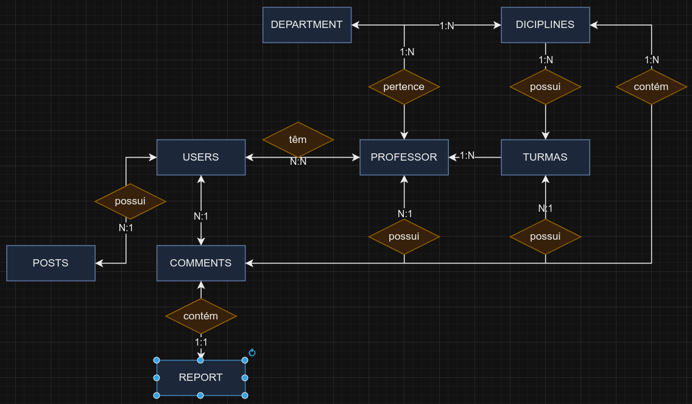
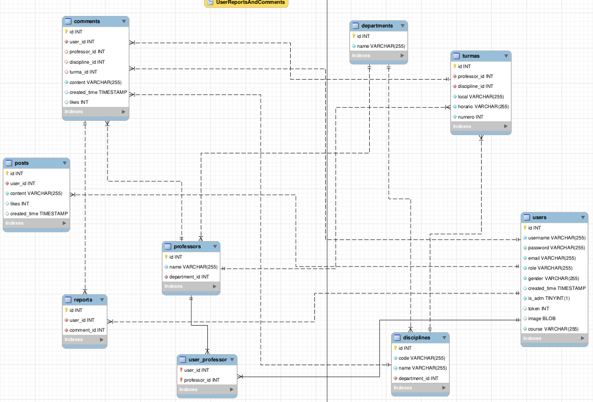

# BDProjeto | Blog para Avaliação de Professores e Disciplinas.
#### Feito por Eduardo Marciano de Melo Meneses, 4 semestre, semestre 2023/1.

## Configurações de ambiente, sistema operacional Linux (Debian):

### Necessário instalação do node.js para rodar o back-end:
	sudo apt update
	sudo apt install nodejs
	sudo npm install -g npm
### Instalar dependências do sistema:
#### 1" alternativa.
		cd .../GitHub/BDProjeto/node
		npm install
#### O npm irá cuidar automaticamente de instalar cada dependência do sistema.
 #### 2" alternativa.
		npm install date-fns@2.30.0
		npm install express@4.18.2
		npm install multer@1.4.5-lts.1
		npm install mysql@2.18.1
		npm install nodemailer@6.9.3
#### Caso a primeira alternativa não funcione, é possível instalar individualmente todas as bibliotecas utilizadas no sistema com sua devida versão.
## Configuração do MYSQL.
### É necessário que o user tenha o MYSQL instalado em seu sistema. A instalação é possível seguindo estes passos:
	sudo apt update
	sudo apt install mysql-server.
#### Depois, será necessário definir uma senha de acesso segura. Isto pode ser feito seguindo estes passos:
### iniciar o serviço do MySQL:
	sudo service mysql start
### Definir a senha do usuário root:
	sudo mysql_secure_installation
### Acessar o shell do MySQL:
	mysql -u root -p
### Alterar a senha do usuário root:
	ALTER USER 'root'@'localhost' IDENTIFIED WITH mysql_native_password BY '@@root123Edu';
### Atualizar os privilégios:
	FLUSH PRIVILEGES;
### Criar a base de dados:
	CREATE DATABASE BDprojeto;
### Conceder privilégios ao usuário root para acessar a base de dados:
	GRANT ALL PRIVILEGES ON BDprojeto.* TO 'root'@'localhost';
	FLUSH PRIVILEGES;
 ## Gerar tabelas e povoá-las:
 ### Por fim, para gerar as tabelas da database e fazer o povoamento automático do banco de dados, execute os seguintes comando:
	node db.js
 	node geraEntidades.js
  	node server.js
## Executar código:
#### Para rodar o sistema, agora, basta apenas usar o Live Server, https://open-vsx.org/extension/ritwickdey/LiveServer, na página de login. Lembre-se de deixar o server.js rodando enquanto a utilização do sistema.
## Modelo Conceitual:

## Modelo Relacional:

## Vídeo Demonstrativo:
### https://youtu.be/HDrOMiBEB-w
## Relatório Técnico:
### https://www.overleaf.com/read/gbfbbbswxqsr

